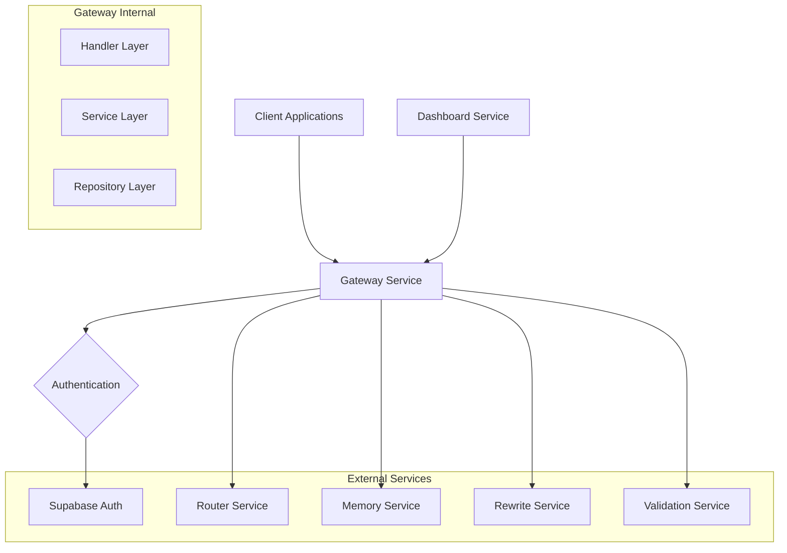

# Technical Solution Design

## Architecture Overview

The Gateway Microservice serves as the unified entry point for the AI API Router system,
implementing a layered architecture with strict separation of concerns. The service integrates with
Supabase for authentication while maintaining full control over business logic and service
coordination.

## Technology Stack

### Core Framework

- **Rust**: Primary programming language for performance and safety
- **Axum**: Web framework for HTTP server and routing
- **Tokio**: Async runtime for non-blocking I/O operations
- **Serde**: JSON serialization/deserialization

### Communication

- **Tonic**: gRPC client library for microservice communication
- **HTTP/REST**: External API interface (Dashboard, client requests)
- **gRPC**: Internal service communication

### Authentication & Security

- **jsonwebtoken**: JWT validation for Supabase tokens
- **reqwest**: HTTP client for Supabase public key fetching
- **tower-http**: Middleware for CORS, tracing, and authentication

### Observability

- **tracing**: Structured logging and distributed tracing
- **tracing-subscriber**: Log formatting and output
- **metrics**: Prometheus metrics collection
- **tower-http**: Request/response logging middleware

### Configuration

- **config**: Configuration management with hot reload support
- **serde**: Configuration serialization
- **tokio-watch**: Configuration change notifications

## System Architecture



## Module Structure

Following the backend development specifications, the Gateway service implements a 3-layer
architecture:

```
gateway/
├── src/
│   ├── lib.rs                  # Main library exports
│   ├── main.rs                 # Application entry point
│   ├── config/                 # Configuration management
│   │   ├── mod.rs
│   │   ├── settings.rs
│   │   └── hot_reload.rs
│   ├── core/                   # Reusable primitives
│   │   ├── mod.rs
│   │   ├── error.rs
│   │   ├── result.rs
│   │   └── tracing.rs
│   ├── features/               # Business-specific modules
│   │   ├── auth/               # Authentication feature (3-layer architecture)
│   │   │   ├── mod.rs          # Module exports and wiring
│   │   │   ├── handler.rs      # Handler Layer - HTTP request/response processing
│   │   │   ├── service.rs      # Service Layer - Authentication business logic
│   │   │   ├── repository.rs   # Repository Layer - Data access & mocks
│   │   │   ├── models.rs       # Data models and structs
│   │   │   ├── types.rs        # Type definitions and enums
│   │   │   ├── constants.rs    # Constants and configuration
│   │   │   └── error.rs        # Auth-specific error types
│   │   ├── ingress/
│   │   │   ├── mod.rs
│   │   │   ├── handler.rs      # Ingress endpoint handlers
│   │   │   ├── service.rs      # Request orchestration
│   │   │   ├── repository.rs   # gRPC client management
│   │   │   └── models.rs       # Request/response models
│   │   └── health/
│   │       ├── mod.rs
│   │       ├── handler.rs      # Health check endpoints
│   │       └── service.rs      # Health check logic
│   ├── executor/               # Executor Layer - LLM API execution
│   │   ├── mod.rs              # Module exports
│   │   ├── config.rs           # Vendor configuration (API keys, pricing, models)
│   │   ├── error.rs            # Executor-specific errors
│   │   ├── models.rs           # Execution request/result models
│   │   ├── service.rs          # Executor orchestration service
│   │   └── vendors/            # Vendor-specific implementations
│   │       ├── mod.rs
│   │       ├── traits.rs       # LLMVendor trait definition
│   │       ├── openai.rs       # OpenAI Chat Completions API
│   │       └── anthropic.rs    # Anthropic Messages API (future)
│   ├── middleware/             # HTTP middleware
│   │   ├── mod.rs
│   │   ├── auth.rs            # Unified authentication middleware
│   │   ├── tracing.rs         # Request tracing
│   │   └── metrics.rs         # Metrics collection
│   └── grpc/                  # gRPC client abstractions
│       ├── mod.rs
│       ├── clients.rs         # gRPC client pool
│       ├── router.rs          # Router service client
│       ├── memory.rs          # Memory service client
│       ├── rewrite.rs         # Rewrite service client
│       └── validation.rs      # Validation service client
```

## Data Flow Design

### Request Processing Flow

1. **HTTP Request Reception**
   - Client sends POST to `/api/v1/route`
   - Axum router receives and routes to ingress handler

2. **Unified Authentication Middleware**
   - Detect authentication method (X-API-Key, Authorization header, etc.)
   - Route to appropriate validator (API Key, JWT, or Service token)
   - For API Key (Phase 1): Validate against database/cache, extract client context
   - For JWT (Phase 2): Validate signature against Supabase public keys, extract user context
   - For Service (Phase 3): Validate internal service tokens
   - Inject appropriate auth context into request

3. **Authorization Check**
   - Verify client/user has required permissions based on context type
   - Check rate limiting and quotas (future implementation)
   - Log access attempt with client/user identification

4. **Request Processing**
   - Parse request payload (prompt + metadata)
   - Normalize prompt into messages array for executor payload
   - Determine service routing based on rewrite flag
   - Create correlation ID for tracing

5. **Service Coordination**
   - Retrieve context data from Memory Service first
   - If rewrite=true: Rewrite Service → Router Service (with context)
   - If rewrite=false: Direct to Router Service (with context)
   - Pass context data to Router Service for cache optimization
   - Parallel calls to Validation services as needed
   - Implement circuit breaker and retry logic

6. **Response Aggregation**
   - Collect responses from all services
   - Merge into unified response format
   - Add metadata (processing time, cost savings, etc.)
   - Update Memory Service with new conversation context

7. **Response Return**
   - Return JSON response to client with cost optimization info
   - Log request completion with relevant cost metrics
   - Track cost savings for dashboard analytics

### Error Handling Flow

1. **Service Failures**
   - Implement circuit breaker pattern
   - Exponential backoff with jitter
   - Graceful degradation strategies

2. **Authentication Failures**
   - Return 401 with clear error messages
   - Log security events
   - Rate limit failed attempts

3. **Authorization Failures**
   - Return 403 with role-specific messages
   - Audit log access violations

## Security Design

### Multi-Method Authentication Security

#### API Key Security (Phase 1 - Primary)

- Store hashed API keys in database using SHA-256
- Validate key format and length before processing
- Implement rate limiting per API key
- Audit logging for all key usage
- Support for key rotation and revocation
- Secure key generation with sufficient entropy

#### JWT Validation (Phase 2 - Dashboard)

- Validate signature using Supabase public keys
- Check token expiration and not-before claims
- Verify issuer matches Supabase project
- Handle key rotation gracefully
- Session management and logout support

#### Internal Service Security (Phase 3)

- Lightweight internal JWT tokens for service-to-service
- Shared secret or internal PKI for validation
- Service identity verification
- Request correlation and audit trails

### Authorization and Access Control

#### API Client Authorization

- Client-level permissions based on subscription tier
- Project-level access control
- Rate limiting and quota enforcement
- Usage tracking and billing integration

#### Dashboard User Authorization

- Role-based access control (RBAC)
- Organization and project-level permissions
- Fine-grained feature access control
- Session-based authorization

### Development Mode Security

- Clear warnings when development mode is enabled
- Environment-based controls (never enabled in production)
- Mock contexts clearly identifiable in logs
- Automatic security hardening in production environments

## Executor Layer Design

### Overview

The Executor Layer is an internal module within Gateway (not a separate microservice) responsible
for executing actual LLM API calls based on routing decisions from RouterService. It abstracts
vendor-specific implementations behind a unified interface.

### Architecture

```
ExecutorService (Orchestration)
    ↓
LLMVendor Trait (Unified Interface)
    ↓
Vendor Implementations (OpenAI, Anthropic, etc.)
    ↓
Vendor APIs (HTTP/REST)
```

### Components

#### 1. Configuration Layer (`config.rs`)

**Responsibility**: Store and load configuration data only (no business logic)

- `ModelPricing`: Stores pricing per 1000 tokens (prompt + completion)
- `OpenAIConfig`: OpenAI vendor configuration (API key, base URL, timeout, models, pricing)
- `ExecutorConfig`: Top-level executor configuration

**Environment Variables**:

- `OPENAI_API_KEY`: OpenAI API key (required)
- `OPENAI_BASE_URL`: Custom endpoint (optional, default: https://api.openai.com/v1)
- `OPENAI_TIMEOUT_MS`: Request timeout (optional, default: 30000ms)
- `EXECUTOR_TIMEOUT_MS`: Global executor timeout (optional, default: 30000ms)
- `EXECUTOR_MAX_RETRIES`: Max retry attempts (optional, default: 3)

**Design Principle**: Configuration layer only handles data storage, loading, and validation. All
business logic (model support checks, cost calculations) is in vendor implementations.

#### 2. Vendor Trait (`vendors/traits.rs`)

**LLMVendor Trait**: Unified interface for all LLM vendors

```rust
pub trait LLMVendor: Send + Sync {
    async fn execute(&self, model: &str, params: ExecutionParams) -> Result<ExecutionResult, ExecutorError>;
    fn vendor_id(&self) -> &str;
    fn supports_model(&self, model: &str) -> bool;
    fn calculate_cost(&self, prompt_tokens: i64, completion_tokens: i64, model: &str) -> f64;
}
```

#### 3. Vendor Implementations

**OpenAIVendor** (`vendors/openai.rs`):

- Integrates with OpenAI Chat Completions API
- Supports models: gpt-4, gpt-4-turbo, gpt-3.5-turbo
- Handles API authentication, request/response serialization
- Calculates costs based on configurable pricing
- Business logic: model support checks, cost calculations

**Future Vendors**:

- AnthropicVendor: Claude models (claude-3-opus, claude-3-sonnet)
- CohereVendor: Command models

#### 4. Service Layer (`service.rs`)

**ExecutorService**: Orchestrates LLM execution workflow

- Vendor registry and selection
- Parameter extraction from original_payload
- Error handling and retry logic
- Streaming response support (future)

**Status**: Placeholder implementation, not yet complete

#### 5. Error Handling (`error.rs`)

**ExecutorError**: Business operation focused errors

- `UnsupportedVendor`: Vendor not configured
- `UnsupportedModel`: Model not supported by vendor
- `InvalidPayload`: Request format invalid
- `ApiCallFailed`: LLM API call failed
- `RateLimitExceeded`: Vendor rate limit hit
- `AuthenticationFailed`: Invalid API key
- `TimeoutError`: Request timeout
- `NetworkError`: Network connectivity issues

### Integration with Ingress Flow

```
Client Request
    ↓
Ingress Handler
    ↓
Ingress Service
    ↓
Repository.optimize_route() → RouterService (gRPC)
    ↓ (returns RoutePlan: vendor_id, model_id)
Repository.execute_llm_call() → ExecutorService
    ↓
ExecutorService.execute(plan, payload)
    ↓
Select vendor by vendor_id → OpenAIVendor
    ↓
Extract params from payload → ExecutionParams
    ↓
OpenAIVendor.execute(model, params)
    ↓
OpenAI API (HTTP)
    ↓
ExecutionResult (content, tokens, cost)
    ↓
Return to client
```

### Configuration vs Business Logic Separation

**Configuration Layer** (`config.rs`):

- ✅ Load from environment variables
- ✅ Store configuration data (API keys, URLs, pricing)
- ✅ Validate configuration completeness
- ✅ Provide default values
- ❌ NO business logic (model checks, cost calculations)

**Vendor Layer** (`vendors/*.rs`):

- ✅ Business logic (model support checks)
- ✅ Cost calculations based on configuration
- ✅ API integration and error handling
- ✅ Access configuration data directly (e.g., `self.config.pricing`)

### Current Implementation Status

- ✅ Configuration system complete
- ✅ OpenAIVendor structure implemented
- ✅ LLMVendor trait defined
- ✅ Error handling complete
- ⏸️ ExecutorService orchestration (placeholder)
- ⏸️ Real API testing (not yet tested with actual API key)
- ⏸️ Integration with ingress service (deferred)

## Gateway Mediation Pattern

### Service Coordination Strategy

- Gateway acts as the single point of coordination for all microservices
- All inter-service communication flows through Gateway
- Context data retrieved from Memory Service and passed to Router Service
- Executor Layer executes LLM calls based on RouterService decisions
- Unified error handling and retry logic across all service interactions
- Complete request tracing and monitoring through centralized flow

### Benefits of Mediation Pattern

- **Loose Coupling**: Services only need to know about Gateway
- **Unified Observability**: All data flows are traceable
- **Consistent Error Handling**: Centralized retry and circuit breaker logic
- **Flexible Data Processing**: Gateway can validate, transform, and cache context data
- **Security**: Single authentication and authorization point

## Performance Considerations

### Async Architecture

- Full async/await implementation
- Non-blocking I/O for all operations
- Connection pooling for gRPC clients
- Parallel processing where possible (validation, logging)

### Caching Strategy

- Cache Supabase public keys with TTL
- Cache user role mappings
- Cache frequently accessed context data for performance
- Implement cache invalidation and TTL management

### Resource Management

- Connection pool limits
- Request timeout configurations
- Memory usage monitoring

## Deployment Architecture

### Configuration Management

- Environment variable injection
- Configuration file support
- Hot reload capability
- Validation on startup

### Health Checks

- `/health`: Basic service health
- `/ready`: Readiness for traffic
- Dependency health checks

### Observability

- Structured logging with correlation IDs
- Prometheus metrics export
- Distributed tracing support
- Error rate and latency monitoring

## Testing Strategy

### Unit Testing

- Service layer business logic
- Authentication/authorization logic
- Configuration management
- Error handling scenarios

### Integration Testing

- gRPC client interactions
- JWT validation flows
- End-to-end request processing
- Health check endpoints

### Load Testing

- Concurrent request handling
- Service coordination under load
- Circuit breaker activation
- Resource usage patterns
