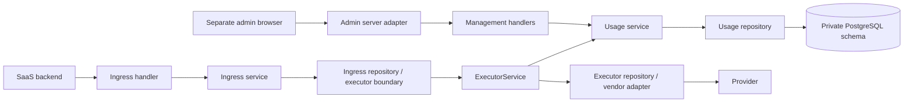

# Backend Design

Status: proposed, 2026-09-22. This document specifies behavior and trade-offs, not implementation
steps. Product scope and evidence are in [requirements.md](requirements.md).

## 1. Guarantees and limits

The system guarantees atomic admission against its own exact, versioned tariff and conservative
exposure bounds. It does not guarantee a provider invoice ceiling: provider pricing, unsupported
billable dimensions, unknown remote execution, traffic outside Opmux, and manual releases can
differ.

The following invariants are mandatory:

1. Authenticated `client_id` is the tenant authority at every layer. No payload, header, cursor, or
   customer reference may override it.
2. No provider dispatch occurs before its request, attempt intent, reservation, and applicable
   account updates commit durably.
3. Every started retry/fallback is metered separately. Metrics and successful-response `cost` are
   not the ledger.
4. A provider call never runs while a PostgreSQL transaction or account row lock is held.
5. Immutable evidence and ledger entries are the accounting history. Mutable balances are checked
   projections, updated in the same transaction as their ledger entries.
6. `unknown` means unknown. Timeout, disconnect, cancellation, and process death do not prove zero
   provider consumption. Elapsed time alone cannot release a possibly dispatched hold.
7. Local uniqueness makes accounting effects idempotent. No claim of exactly-once provider execution
   or exactly-once HTTP response delivery is made.
8. Existing response fields and opaque metadata semantics remain compatible. New behavior is
   additive until a manager explicitly activates enforcement.

## 2. Architecture and module boundaries

Use the existing Rust application and PostgreSQL instance. This workload does not justify a new gRPC
mesh, Redis lock service, queue broker, or a separate ledger deployment.



`features/usage/` owns customer registration, price snapshots, usage records, allowance policy,
transactional operations, queries, events, and recovery. Keep handler/service/repository separation;
split internal models and operations by responsibility rather than one large service file.

- Handlers authenticate capability, parse DTOs/headers, and serialize responses/errors. They do not
  access PostgreSQL or compute balances.
- Usage service owns policy, arithmetic, state transitions, and reconciliation decisions. Its
  repository performs parameterized SQL, locking primitives, transaction writes, and reads. The
  service supplies validated transition commands; repositories enforce relational invariants too.
- Ingress passes a typed `ExecutionIdentity { client_id, key_id, usage_request_id, attribution }`.
  Request context for tracing remains separate. Missing auth context is never replaced with mock
  IDs.
- ExecutorService invokes usage-service reservation/finalization at each actual attempt boundary.
  Its repository remains the only executor component contacting vendors. Vendor adapters expose
  typed usage/dispatch evidence, and do not implement retries, policy, or ledger writes.
- Dependencies are constructed/injected in `app.rs`; the production router is also used in HTTP
  fixtures. Preserve the current correlation/metrics/deadline/auth middleware composition.
- The generation admission permit is acquired before durable accounting. Overload does not create
  money holds. Database accounting deadlines fit inside the protected request deadline.
- Recovery is a supervised application service with repository access, not request-local detached
  tasks or asynchronous work in `Drop`. Multiple replicas coordinate through PostgreSQL claims.

The cost of this design is PostgreSQL work on each attempt and contention on a high-volume tenant's
account row. That is a deliberate correctness trade-off. There is no measured throughput or latency
claim; a later scaling change must preserve admission semantics.

## 3. Identity and attribution

| Identity           | Meaning and rules                                                                                |
| ------------------ | ------------------------------------------------------------------------------------------------ |
| `client_id`        | Existing tenant UUID from AuthContext; immutable ownership anchor                                |
| `customer_id`      | Server UUID for a SaaS tenant's end customer; always resolved within `client_id`                 |
| `external_id`      | Tenant-supplied opaque customer reference, unique within tenant; immutable, case-sensitive       |
| `workflow_id`      | Optional opaque feature/workflow reference, at most 128 ASCII identifier characters              |
| `task_id`          | Optional opaque business-run reference, at most 128 characters; groups requests, not idempotency |
| `usage_request_id` | Server-generated UUID for one accepted generation operation                                      |
| `attempt_id`       | Server-generated UUID for one provider attempt, unique ordinal within a usage request            |
| `request_id`       | Existing per-HTTP correlation ID; never an accounting primary key                                |

Add an optional, typed top-level `attribution` object to `/api/v1/route`. Do not extract attribution
from `metadata`; the existing promise that metadata is never persisted remains intact. Persist only
the allowlisted attribution fields, never arbitrary metadata, prompt text, or generated content.

In observation mode, omitted attribution goes into the tenant's unallocated reporting bucket. A
supplied customer must still exist, be active, and belong to the tenant. In enforcement mode,
`customer_id` is required. Customer creation is management-only; no automatic creation from an
inference request. Unknown/cross-tenant customers receive indistinguishable `404 NOT_FOUND`.

Customer status is `active` or `suspended`; suspension blocks new attempts, including later attempts
of an already admitted request, but does not revoke a reservation already committed before the
suspension. Attempt admission linearizes at reservation commit; an already reserved attempt may
still dispatch and settle. Customer IDs and external IDs cannot be reassigned or deleted while
history exists. Workflow/task IDs are tenant-local labels, not objects that grant access. Tenant
inference keys must be held by the SaaS backend, which derives customer identity from its own
authenticated user rather than forwarding untrusted browser input.

## 4. Money, usage evidence, and pricing

### 4.1 Exact representation

- Internal accounting uses integer nano-USD: `1 USD = 1,000,000,000 nanos`.
- PostgreSQL amounts use `NUMERIC(30,0)` with nonnegative checks where applicable; signed deltas use
  the same exact type. Rust uses checked integer/decimal arithmetic, never `f64` for ledger math.
- API monetary fields are canonical decimal strings with exactly nine fractional digits. Negative
  values are permitted only on explicitly signed adjustment/delta fields.
- Token counts and aggregate counts are nonnegative integer strings in new APIs, avoiding JavaScript
  precision loss. Revisions and page limits remain bounded JSON integers.
- Bounds are rounded up. Settled configured-tariff cost is rounded up once per attempt to one nano;
  there is no rounding per token or daily-total recomputation. The maximum rounding uplift is less
  than one nano per priced attempt.

For the supported flat text tariff:

```text
cost_nanos = ceil((input_tokens * input_rate_nanos_per_million
                + output_tokens * output_rate_nanos_per_million) / 1_000_000)
```

Example: 120 input tokens at $1/million and 30 output tokens at $2/million yield 180,000 nanos, or
`"0.000180000"`. These are illustrative prices, not a provider price sheet.

The current `/api/v1/route.cost` number retains its existing successful-response estimate and
eight-decimal behavior. The new ledger uses exact price material parsed from the original decimal
configuration, not a conversion of a previously rounded float. Reject price representations outside
the proposed exact range/precision; retain original lexical rates in a price snapshot. The two
surfaces intentionally have different scopes and must not be substituted for one another.

### 4.2 Evidence is multidimensional

Do not use one ambiguous `confirmed` flag. Each attempt records:

| Field              | Values                                                                 | Meaning                                                                                  |
| ------------------ | ---------------------------------------------------------------------- | ---------------------------------------------------------------------------------------- |
| `dispatch_state`   | `prepared`, `dispatch_intent`, `terminal`                              | Whether durable permission to send existed; intent is not proof the provider received it |
| `usage_evidence`   | `provider_reported`, `operator_attested`, `not_sent`, `unknown`        | Source/availability of usage counts                                                      |
| `cost_basis`       | `configured_tariff`, `unknown`                                         | How cost was derived; v1 never emits `provider_invoice`                                  |
| `settlement_state` | `reserved`, `pending_reconciliation`, `settled`, `released_unverified` | Whether capacity remains held and how it ended                                           |

Provider-reported tokens still produce a configured-price estimate, not a confirmed invoice amount.
On unknown usage, token/cost fields are null. A manager releasing uncertain capacity does not turn
that null into zero; the released bound remains visible as `released_unknown_exposure`.

### 4.3 Price and bound snapshots

Persist an immutable snapshot before the first attempt using it: target ID, requested model,
provider ID, exact input/output rates, currency, pricing formula version, config digest, effective
time, and bound-profile version. Uniqueness is the normalized configuration digest. Different
targets may price the same model differently. Later catalog edits never rewrite old estimates.

Record provider-reported model separately from requested alias. A result outside the bound profile's
permitted alias/model family becomes a reconciliation exception; do not blindly price it using a
different current catalog entry.

V1 supports a flat configured text tariff. Cache discounts, reasoning tokens, multimodal units,
tools, tiered pricing, and ancillary provider charges are not silently treated as free. A target can
enforce an allowance only if its operator-reviewed profile covers all billable dimensions it admits.
Observation mode may report a deliberately conservative flat estimate with a pricing caveat.

### 4.4 Obtaining a safe reservation bound

For each attempt, compute `B` using its immutable price/bound snapshot and actual generation cap:

1. A model-specific estimator provides a documented upper bound for billable input tokens, including
   message framing. A heuristic such as characters divided by four is not an enforceable bound.
2. Alternatively reserve the target's verified maximum billable input capacity. This is conservative
   and can reject a short request that would actually fit financially; expose that reason clearly.
3. Bound output by a provider-enforced total billable output cap. A visible-text cap is insufficient
   when additional billable output can exceed it.
4. If neither input strategy or the output assumption is verifiable, the target is unavailable for
   enforcement (`503 METERING_UNAVAILABLE`). Merely filling in a guessed config value is not proof.

Profiles contain the method, limits, estimator version, model family, supported dimensions, and
operator verification reference. Existing catalog settings lack this complete contract; enforcement
cannot simply be switched on for all currently configured targets. Observation remains available.

## 5. Logical persistence model

All proposed tables belong to `opmux_private`. This is a logical schema, not executable migration
DDL. UUID primary keys have `(client_id, id)` uniqueness where needed for tenant-scoped foreign
keys.

| Entity                    | Essential fields                                                                                                                                              | Constraints / indexes                                                                                                        |
| ------------------------- | ------------------------------------------------------------------------------------------------------------------------------------------------------------- | ---------------------------------------------------------------------------------------------------------------------------- |
| `usage_settings`          | client_id, mode, policy_revision, updated_at                                                                                                                  | One per tenant; default observe; revision changes only on management edits                                                   |
| `usage_customers`         | id, client_id, external_id, display_name, status, revision, created_at                                                                                        | Unique tenant/external_id; tenant/created_at/id cursor index                                                                 |
| `price_snapshots`         | id, configuration_digest, target/provider/model, exact rates, formula and bound profile                                                                       | Immutable; digest unique; no credentials or endpoint secrets                                                                 |
| `usage_requests`          | id, client_id, key_id, customer_id nullable, workflow_id, task_id, correlation_id, route_id, state, admitted_at, completed_at, request_fingerprint            | Composite tenant/customer and tenant/key foreign keys; tenant/customer/time/id and tenant/task/time indexes                  |
| `usage_attempts`          | id, client_id, request_id, ordinal, target_id, price_snapshot_id, execution outcome, usage/cost evidence, lifecycle revision, dispatch_deadline, worker token | Unique request/ordinal; tenant/request FK; recovery index by lifecycle/deadline                                              |
| `usage_evidence`          | id, client_id, attempt_id, evidence_version, source, token counts nullable, provider_request_id nullable, evidence_ref, recorded_at                           | Append-only; unique attempt/evidence_version; evidence_ref bounded and never fetched as a URL                                |
| `allowance_accounts`      | id, client_id, scope, customer_id nullable, base_limit_nanos, policy_revision, outstanding_hold_nanos                                                         | One tenant account via partial unique index; one per customer via separate partial unique index; never nullable-UNIQUE alone |
| `allowance_periods`       | id, client_id, account_id, start_at, end_at, base_limit_nanos, adjustment_nanos, settled_nanos, revision                                                      | Unique account/start_at; UTC calendar boundaries; settled nonnegative; effective limit nonnegative                           |
| `attempt_reservations`    | id, client_id, attempt_id, bound_nanos, state, lifecycle_revision                                                                                             | One reservation per attempt, not one per provider/model name                                                                 |
| `reservation_allocations` | reservation_id, client_id, account_id, period_id, held_nanos                                                                                                  | Unique reservation/account; tenant and customer accounts both hold the same attempt exposure                                 |
| `usage_ledger`            | id, client_id, attempt_id nullable, account_id, period_id, event_type, held_delta, settled_delta, capacity_delta, operation_id, recorded_at                   | Append-only; unique operation/account/event identity; tenant/period/time/id index                                            |
| `management_operations`   | id, client_id, actor_key_id, action, target_id, reason, before/after, committed_at                                                                            | Immutable audit; no prompt, credential, request payload, or browser bearer token                                             |
| `idempotency_records`     | client_id, namespace, key_digest, fingerprint, operation_id, state, safe response, expires_at                                                                 | Unique tenant/namespace/key_digest; generation never stores generated content                                                |
| `usage_events`            | id, client_id, account/customer/period references, kind, threshold, policy_revision, payload, occurred_at, acknowledged_at                                    | Durable in-app feed; unique period/account/threshold/policy revision for warnings                                            |

Ledger rows for the tenant and customer are parallel constraint projections of one usage fact. Cost
reporting aggregates attempts/evidence once; it must never sum both account projections as two
charges. Every allocation carries the tenant ID and references the same tenant's account/period.

An account/period base is nullable until a policy is configured. Account records also retain the
pending next-period base/effective date and an `unbounded_hold_count` projection. A reservation
bound is nullable only in observation mode. Such reservations append an explicit unbounded-count
delta alongside monetary ledger deltas; their numerical held subtotal may be zero but their exposure
is unknown. Reconciliation checks the count projection as well as monetary projections. Scheduled
policy activation changes the effective-month component of its ETag, not the management revision.

Ledger entries have the following exact projection effects (`B` is a reservation bound, `C` an
estimated cost, `D` a signed capacity/cost correction). The table applies independently to each
constraint account; it is not a second usage charge:

| Entry                                                             | Held delta | Settled delta | Capacity delta |
| ----------------------------------------------------------------- | ---------- | ------------- | -------------- |
| `reserved`                                                        | +B         | 0             | 0              |
| `settled`                                                         | -B         | +C            | 0              |
| `released_not_sent`                                               | -B         | 0             | 0              |
| `marked_unknown`                                                  | 0          | 0             | 0              |
| `released_unverified`                                             | -B         | 0             | 0              |
| `capacity_initialized` / `capacity_rebased` / `capacity_adjusted` | 0          | 0             | +D             |
| `cost_corrected`                                                  | 0          | +D            | 0              |

For unbounded observation reservations, hold changes instead increment/decrement the separate
unbounded-count projection; cost stays null until supported evidence exists. Ledger operation IDs
are stable across transaction retries. A correction must reference superseded evidence, and the
resulting per-attempt valuation cannot be negative. Rebuilding compares account holds across all
periods, settled sums per period, capacity initialization/changes, and unresolved-count totals; it
never adds the tenant and customer projections together as provider consumption.

Application repositories require a typed tenant argument. Every object read/update includes its
tenant predicate; bulk queries and cursors follow the same rule. Composite foreign keys prevent
cross-tenant relationships. New tables receive no grants to Supabase `anon`, `authenticated`,
`authenticator`, `service_role`, or `PUBLIC`; runtime permissions are operation-specific. Ledger,
evidence, price, and audit tables deny ordinary UPDATE/DELETE. The administrative web app has no
database role. This design uses the existing private-server database boundary, not new RLS rules
that might misleadingly imply protection against a fully compromised runtime role.

## 6. Allowance semantics

Each account has a recurring monthly base allowance and each period may have signed capacity
adjustments. Adjustments change available capacity, never recorded usage. Negative adjustments may
reduce a limit below existing exposure, but the effective limit cannot become negative.

```text
effective_limit = period.base_limit + period.adjustments
committed_exposure = period.settled + account.outstanding_hold
available = max(0, effective_limit - committed_exposure)
overcommitted = max(0, committed_exposure - effective_limit)
```

`account.outstanding_hold` includes active and uncertain reservations from all periods, including
previous months. The API breaks it into active current, uncertain current, and carry-over
components. Current-month settled estimates exclude previous-month settled costs. Settling an old
hold updates its original period and removes its carry-over exposure; it does not charge the new
month again.

Each attempt chooses its period after acquiring account locks using PostgreSQL `clock_timestamp()`,
not the earlier transaction-start timestamp. A request spanning midnight may have attempts in
different periods. A late result always settles its reservation's original period. Lazy period
creation under the account lock removes any dependence on a cron reset. An old period can still
receive evidence; period end is not accounting finality.

In `enforce`, an active customer, a tenant policy, and that customer's policy are all required. The
same attempt bound must fit both accounts. A zero limit rejects positive exposure. Policy absence is
not unlimited credit. Policy deletion and automatic budget-to-cheaper-model fallback are absent.

In `observe`, records/holds use the same accounting protocol but admission ignores capacity. A
missing policy has no monetary ceiling, not a zero ceiling. If a bound is unavailable, record an
unbounded unknown exposure explicitly; balance completeness becomes false and enforcement activation
is blocked until it is resolved or an operator-reviewed bound is supplied.

Changing `observe` to `enforce` requires finite policies, usable bound profiles, and no unbounded
unknowns. Existing current-period consumption counts; activation does not start from zero. Both mode
transitions affect future attempt admissions, including retries, never cancel a sent call, and are
audited. Settlements preserve the identity and period fixed when each reservation was made.

An explicitly audited unverified release ends a hold, including an unbounded hold, but does not make
historic consumption known. Activation after such a release excludes that accepted historic risk
from its cap and keeps the released-uncertainty warning visible.

## 7. Transactions and concurrency

Use short READ COMMITTED transactions with explicit row locks and invariant rechecks. PostgreSQL's
[row-lock behavior](https://www.postgresql.org/docs/17/explicit-locking.html) supplies
serialization; the following protocol is an Opmux design, not something an isolation label
guarantees by itself.

All mutating operations acquire locks in this order: tenant usage-settings row, tenant account,
customer account (if any), their periods, usage request, attempt/reservation, then idempotency/audit
records. A shared settings lock suffices for inference; settings edits acquire an exclusive lock.
Account locks use a fixed tenant-first order. Customer state changes also acquire its account lock.
Never hold a customer/attempt lock and later request the tenant account. Recovery candidate
discovery does not retain locks across acquisition of the normal order.

### 7.1 Admission and reservation

1. Validate authentication, request shape, route, generation cap, customer, and local admission.
2. Determine target eligibility under the existing circuit/deadline rules; compute the versioned
   bound. A skipped target has no provider attempt or money reservation.
3. Begin the reservation transaction and acquire locks in the common order. Insert missing account/
   period rows using unique constraints, then lock/re-read. In observe mode accounts may exist with
   no policy. A management edit or suspension that won the lock is seen before admission.
4. Resolve generation idempotency; create the usage request if this is its first admitted attempt.
   Recheck customer state, enforcement mode, time, applicable limits, and available capacity.
5. Insert the attempt/reservation/allocation rows, append reserve entries, update account holds, and
   insert any threshold events in the same transaction. If either allowance fails, roll back all
   financial writes. An admission denial may be a separate nonfinancial event.
6. Commit. Only after commit acknowledgement may this process authorize dispatch. An ambiguous
   commit acknowledgement is looked up by operation ID; it never triggers a second reservation or a
   speculative provider send.

Before network access, a second short transaction changes `prepared` to `dispatch_intent` using a
unique worker token and lifecycle revision. It rejects an expired/recovered preparation. Only the
winner may send. The worker does not resume/re-send a committed intent after restart. This
deliberately leaves a possible false-positive hold if it crashes before the actual send.

Enforcement activation takes the exclusive tenant-settings lock, blocking concurrent admissions and
customer creation while it validates the tenant and all active customer policies. Customer creation
uses the same settings/account lock order. A customer created while enforcement is on may initially
have an unconfigured account, but every request for it is rejected until its policy is explicitly
set. This prevents a configuration race from creating an unlimited-customer path.

### 7.2 Finalization

Parse provider evidence independently from whether generated content is a valid successful response.
A response can fail the application protocol yet still provide usable token evidence. The adapter
returns a typed observation; raw provider bodies are not persisted.

In the normal transaction/lock order, verify reservation identity and transition revision, append
immutable evidence, and apply exactly one settlement operation:

| Result                                      | Accounting effect                                                                                                                        |
| ------------------------------------------- | ---------------------------------------------------------------------------------------------------------------------------------------- |
| Provider usage valid and supported          | Remove full bound from held exposure; add exact estimate to original-period settled amount                                               |
| Proven not dispatched                       | Remove hold; append `not_sent` evidence and release entry; zero provider usage is justified                                              |
| May have been dispatched, usage unavailable | Move to pending reconciliation; keep bound held; cost and token counts remain null                                                       |
| Known usage exceeds bound                   | Record full actual estimate, remove hold, flag bound violation and block affected target for enforcement; never clamp the recorded usage |

Only an actual pre-send failure proved by the adapter is `not_sent`. A generic connection error,
HTTP 5xx, 429, malformed body, cancellation, or elapsed timeout does not by itself establish free
execution. Without supported usage/no-charge evidence it remains unknown. Valid partial token data
is insufficient for a complete cost and must not fabricate missing dimensions.

The result may be successful while a previous attempt remains uncertain; request accounting is then
`pending` at request level; the individual attempt is `pending_reconciliation`. Execution status and
accounting status are separate API fields.

Request `execution_state` is `running` after first admission, then `succeeded`, `failed`, or
`cancelled` when the executor records its local outcome. Recovery uses `unknown` if that outcome was
lost; provider evidence alone does not prove that the caller received an answer. `accounting_state`
is `pending` while any reservation is active/uncertain, otherwise `released_unknown` if any attempt
ended in an unverified release, otherwise `complete`. Known errors/not-sent attempts can therefore
be accounting-complete. Completing a request never releases an uncertain attempt implicitly.

If finalization cannot commit before the request deadline, do not send an ordinary success claiming
settled accounting. Return `503 ACCOUNTING_UNAVAILABLE` if time remains, otherwise the existing
deadline error. The durable intent/hold remains for recovery. Recovery cannot reconstruct lost token
evidence from memory, and may require operator attestation. An application error can therefore
coexist with provider consumption; the request detail makes that visible. The gateway can return
success with a durable pending record for an earlier failed attempt; it may not return success while
persistence of the current attempt's evidence/settlement is unacknowledged.

### 7.3 Retries, fallback, cancellation, and expiry

Each eligible retry/fallback finalizes or marks the prior attempt uncertain, then obtains its own
reservation. Unknown exposure on the earlier attempt remains reserved. Reserve only the next actual
attempt, not the entire hypothetical fallback tree. This avoids excessive initial holds but means a
request can stop between attempts for insufficient capacity.

Insufficient local allowance is terminal `429 ALLOWANCE_EXCEEDED`; it never invokes a cheaper model
or becomes a provider-retryable error. Existing overall-deadline expiry remains the terminal `504`.
Attempt-count limits, fallback eligibility, provider Retry-After, capability checks, and circuits
remain owned by ExecutorService. A ledger failure does not count as provider circuit failure.

If an attempt was prepared but not marked for dispatch, cancellation/recovery may release it with
`not_sent` evidence. Once intent exists, cancellation preserves the hold unless valid usage arrives.
Finalization runs through supervised work with bounded shutdown time; `Drop` may signal cancellation
but cannot be relied on for durable database writes.

## 8. Recovery and reconciliation

Reservations persist a dispatch deadline and a lifecycle revision. Recovery scans expired work, then
acquires the normal locks and compares revisions before changing anything. Multiple replicas can
discover the same candidate; exactly one state transition wins. Workers never retry provider
generation as a recovery action.

- Expired `prepared`: fence the worker, release the hold, mark not-sent.
- Expired `dispatch_intent`: mark pending reconciliation, retain exposure, create one warning.
- A valid late result can settle a pending reservation if no terminal resolution won first.
- If a manager already resolved it, store late evidence as a conflict event; do not apply a second
  automatic charge. A reviewed correction references the prior resolution and applies only the
  delta.

Management resolution supports two explicit operations with a reason and opaque evidence reference:

1. `attest_usage`: supply supported token counts based on reviewed external evidence. Use the
   original price snapshot; mark source `operator_attested`, not provider-confirmed billing.
2. `release_unverified`: release held capacity without asserting zero consumption. Preserve unknown
   usage and record the released exposure amount. The response and UI describe the weakened cap.

The public v1 resolution endpoint only acts on pending attempts. A correction to an already terminal
resolution is an operator-reviewed accounting operation with unique evidence identity; no arbitrary
public ledger rewrite endpoint exists. Recovery and reconciliation must not infer cost by searching
raw prompts or re-running a generation.

| Failure boundary                         | Durable result and safe behavior                                                               |
| ---------------------------------------- | ---------------------------------------------------------------------------------------------- |
| Before reservation commit                | No provider call; no committed exposure                                                        |
| Reservation commit acknowledgement lost  | Read by operation identity; no speculative send                                                |
| After reserve, before dispatch intent    | Recover as not sent after fencing                                                              |
| After intent, before send                | Indistinguishable from remote execution after crash; keep hold                                 |
| Provider completed, local result lost    | Unknown hold; never automatically retry as recovery                                            |
| Settlement committed, HTTP response lost | Accounting complete; inference duplicate suppressed; generated text is not replayed            |
| Duplicate settlement message             | Same operation identity is a no-op; differing evidence creates a conflict                      |
| PostgreSQL unavailable                   | Fail closed for new accounting/dispatch; outstanding holds survive                             |
| Balance/ledger reconciliation mismatch   | Block admissions for affected account and emit operator event; do not silently repair balances |

## 9. Idempotency and optimistic concurrency

Management creates, signed adjustments, mode changes, and resolutions require `Idempotency-Key`.
Scope is tenant plus operation namespace plus normalized target. The server hashes a canonical,
validated request, including reason and preconditions; same key/different request returns
`409 IDEMPOTENCY_CONFLICT`. Same key/same request returns its original safe operation response.
Concurrent requests resolve through a unique database record in the mutation transaction. A pending
operation returns `409 OPERATION_IN_PROGRESS` with bounded retry guidance. Definitive validation
failures before execution need not claim a key; ambiguous commit must be read back before retry.

Keep management replay records for at least seven days. Operation IDs and ledger uniqueness outlive
that cache; clients must not assume a reused key is deduplicated after its documented expiry.

Generation uses an optional `Idempotency-Key` in observe mode and requires one in enforce mode. It
has a 90-day deduplication window, tenant scope, and a keyed fingerprint of validated prompt,
parameters, attribution, and resolved request controls. Metadata is excluded because it has no
execution semantics and must remain opaque. The fingerprint key version is recorded for rotation;
plaintext prompts and responses are never stored. Same-key duplicates never re-dispatch: they return
`409 INFERENCE_ALREADY_SUBMITTED` and `X-Opmux-Usage-Request-ID`. A changed fingerprint returns
`409 IDEMPOTENCY_CONFLICT`. This is duplicate suppression, not response replay. The original request
may have failed, completed, or become uncertain; a manager can query its status.

Customer/policy/settings mutations require a strong ETag from the corresponding configuration GET
and `If-Match`. Missing preconditions return `428 PRECONDITION_REQUIRED`; stale versions return
`412 PRECONDITION_FAILED`. Accounting counters do not bump policy ETags, so normal traffic does not
cause endless edit conflicts. Policy ETags also include the effective UTC month, so a scheduled
activation or month boundary can invalidate a previously fetched ETag. A successful idempotent
replay is checked before re-evaluating its old If-Match precondition. A new edit always gets a new
idempotency key.

## 10. Queries, warnings, and management behavior

### Query semantics

- Query PostgreSQL's primary. Balance responses read account/period state in one consistent
  snapshot; they are informative, not reservation tokens.
- Range summaries use one read-only REPEATABLE READ transaction across their result queries. Include
  `as_of`, explicit `[from,to)` UTC boundaries, and `complete`/uncertainty fields.
- Cost totals sum one latest evidence valuation per attempt. Corrections replace valuations for
  reporting but remain append-only in history. Attempt admission time determines reporting period; a
  late settlement changes the historical period's totals.
- Separate `settled_estimate`, `pending_exposure`, `released_unknown_exposure`, unknown attempt
  count, and unbounded unknown count. A known zero and an unknown null are not interchangeable.
- Request lists are keyset-paginated by `(admitted_at,id)` descending with signed,
  tenant/filter-bound opaque cursors. A fixed upper membership boundary prevents new rows shifting
  subsequent pages. Status/amounts are latest at each page read, not a historical accounting
  snapshot across pages.
- Queries support at most 31 days per range and pages of 1–100 rows (default 25). A task spanning
  windows is intentionally queried in bounded ranges; arbitrary SQL grouping is not exposed.
- Group summaries by exactly one of day, customer, workflow, target, or task. Unassigned values are
  an explicit null bucket. Sort groups by their stable group key and paginate them too.
- Tenant, customer, workflow/task, key, and request IDs never become Prometheus labels. Detailed
  attribution lives in the authorized API. New metrics use bounded state/outcome classes only.

### Allowance changes

A policy edit chooses `current_and_future` or `next_period`. The former updates the current period's
base and the recurring base; the latter schedules the next UTC month without changing current base.
Only one future base is scheduled per account, replaced by a later audited edit. Current-period
adjustments survive base edits and never carry forward. Policy fields and historical period bases
are distinct to prevent a retroactive rewrite of past months.

Reducing capacity below exposure is allowed, with `overcommitted` returned and new admission denied.
Existing dispatched work can finish. There is no reset-consumption action. A current-period grant is
a signed adjustment with a reason and idempotency key, not a fake negative cost event.

### Persistent warnings

Emit warnings at 80% and 100% of effective capacity using committed exposure (including holds), plus
unknown-usage, bound-violation, and accounting-unavailable events. Zero capacity warns on the first
rejected positive reservation rather than dividing by zero. Emit each threshold once per
account/period/policy revision; a policy change may create a new relevant warning. Do not generate a
storm when a hold is released and the same threshold is crossed repeatedly.

Events are inserted transactionally with the relevant state change and read through a tenant-scoped
feed. Acknowledgement is shared tenant state with actor/time audit, not deletion or accounting
resolution. In-app acknowledgement does not release a hold. No webhook URL or delivery worker is
needed for v1; a future external channel can consume an outbox without entering the admission path.

## 11. Security, operations, and retention

- Management endpoints use the existing management key capability. Inference keys cannot read
  tenant-wide usage or edit allowances. Existing management keys have broad tenant control; finer
  human roles belong to the separate host's authorization until a future gateway role model exists.
- Do not persist prompts, completions, opaque metadata, secrets, or credential-bearing URLs. Opaque
  customer/task IDs must not be email addresses or personal data by convention. Bound ID lengths and
  customer creation limits prevent unbounded label/object creation.
- API-key actor identity is authoritative in gateway audit. Human actor identity belongs to the
  admin server's own audit linked by operation/request IDs; do not trust a browser-supplied actor
  header.
- Responses carrying usage or policy data use `Cache-Control: no-store`. New API errors preserve the
  existing `{error:{code,message,request_id}}` shape. Never include SQL, provider payloads, or
  another tenant's resource existence in an error.
- Database admission/settlement timeouts are bounded; no unbounded queueing behind tenant locks.
  Lock timeouts return `503 ACCOUNTING_BUSY`, not a fabricated allowance denial. Retry database
  transactions only before dispatch or with a stable settlement identity.
- A bound violation quarantines the target/bound-profile digest in durable metering state shared by
  replicas; a process-local circuit flag is insufficient. Only an operator-reviewed replacement
  profile clears it. A ledger/projection mismatch similarly persists an account admission block
  until audited repair. Neither state is cleared by restarting a gateway or changing UI filters.
- Usage reads have a configurable two-second database budget and per-process bounded management
  query concurrency (default eight); saturation returns `503 ACCOUNTING_BUSY`. Queries do not retain
  cursors as live database transactions. Accounting work retains a separate bounded pool share so
  report scans cannot consume all admission/settlement connections. These are resource control
  defaults, not measured SLOs or a distributed customer request-rate quota.
- `/ready` includes required usage schema/privilege checks when the feature is enabled. Enforcing
  routes additionally require usable bound profiles; observation alone does not require them. An
  exhausted individual customer allowance does not make the entire gateway unready. Successful
  dependency checks may cache; failed checks remain uncached.
- Shutdown stops new dispatch, allows bounded finalization, and leaves unresolved durable intents
  for recovery. Recovery health and oldest-unknown age are operational signals.
- Default ledger/evidence/audit retention is 13 months; feed and generation deduplication retention
  is 90 days, management replay retention seven days. Retention is a proposed operational default,
  not a compliance claim. Never purge unresolved holds, referenced price evidence, or the history
  needed to rebuild a retained balance. Completed expired history may be archived only with a
  verifiable balance checkpoint; v1 requires no automatic destructive purge.
- Restoration from a database backup may lose records for already executed remote calls. Recovery
  after restore requires admission to remain paused until an operator reconciles the uncertainty;
  backup restoration is not proof of provider accounting completeness.

## 12. Deliberate exclusions and trade-offs

This design adds correctness and explainability to the existing gateway. It does not change its
model-selection strategy or promise quality-preserving cost optimization. Exact local accounting
adds database contention; conservative unknown holds may inconvenience users; strict bounds can
reserve more than actual usage; no prompt persistence prevents replaying a lost generated answer.
These limitations are explicit in the API and administration contract rather than hidden behind a
single apparently precise balance.

SQL migrations, Rust changes, frontend implementation, human-login integration, provider calls,
deployment, and a development task breakdown are outside this design-only deliverable.
